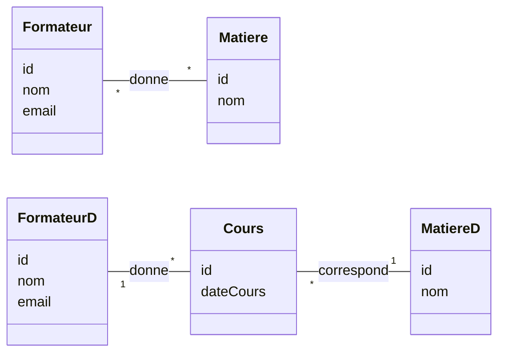

# Analyse BD Merise 

## Contenu

Ce repo contient de notes et des exercices concernant l'analyse de BD avec Merise

```sql
SELECT * FROM stagiaire
SELECT nom, email FROM stagiaire
```

Snippet de js:

```javascript
console.log ("Hello, du JS");
let a = 25;
```
Snippet de php:

```php
echo "Salut";
```

Le plot sera:
- Comprendre l'objectif de l'analyse 
- Apprendre à créer le dictionnaire de données
- Apprendre à créer un MCD
- Apprendre à créer le MLD à partir du MCD

Diagrammes mermaid!!




